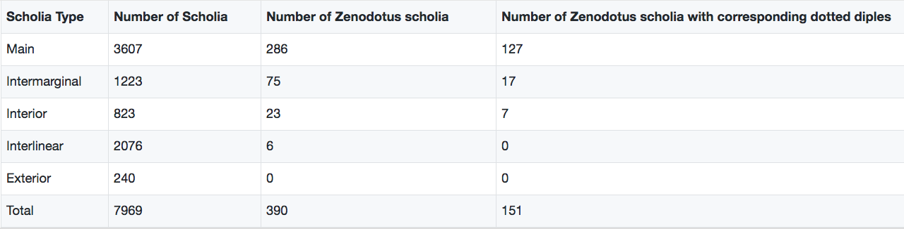
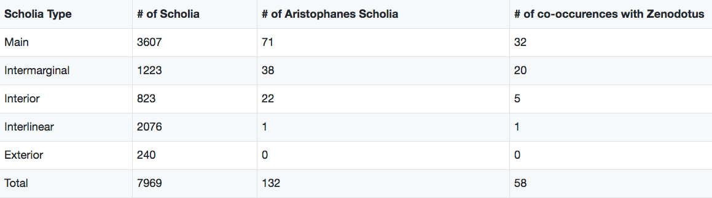
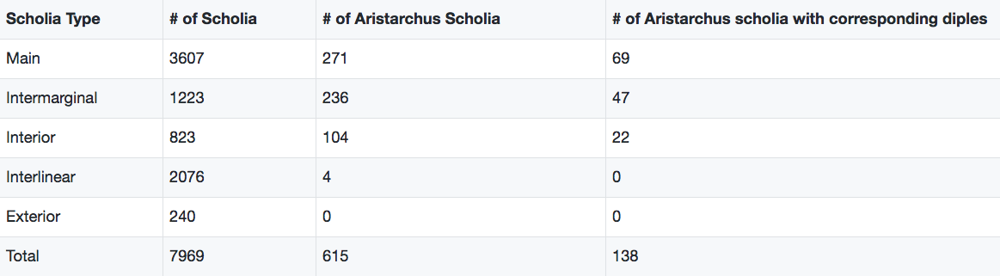

## Initial analysis

As I mentioned in the introduction, when the Homeric epics began to interact with writing, there were many different versions which were recorded. This is because each telling of the *Iliad* or the *Odyssey* was different due to their originally oral nature. That is, there is no one authoritative text. Because of this, there exist many "multiforms," or different readings of certain words, phrases, or whole lines. These multiforms can be seen very easily when one looks at the scholia of the 10th century C.E. Venetus A manuscript. The Alexandrian editors, who were working in the 3rd and 2nd centuries B.C.E., created their own editions of the *Iliad* which were very influential in shaping the text of the epic that we have today. Specifically, they are believed to be responsible for narrowing down the canon of multiforms which we have today. These Alexandrian editors and their editions will prove to be extremely important in this analysis due to the frequency of references to them in the Venetus A scholia. The editions of these editors are unfortunately not extant have not been for quite some time. However, some of their comments were transmitted and preserved in the Venetus A.
 
As I also explained in the introduction, the ultimate goal of this thesis is to pinpoint more precisely specific source material for the scholia. For this thesis, I focused most of my attention on specifically attempting to recover material in the scholia of the Venetus A manuscript which comes directly from the editions of Aristachus, one of the Alexandrian editors. More broadly, my aim is to be able to determine the features which are associated with Aristarchan language and thereby create a model for determining with some confidence whether a scholion is Aristarchan or post-Aristarchan.
 
Because of the prevalence of Aristarchus in the scholia, it is most convenient to begin with identifying features which point toward an Aristarchan source, rathern than a Zenodotian or Aristophanean. A “feature” is any measurable aspect of a scholion. Because of the digital editions which I described previously, there are countless features which I am able to extract and analyze together. It is my hope that representing thousands of scholia as a set of features that they do or do not contain will make analysis simpler. Each question will simply be a matter of extracting the scholia which have the specific combinations of features I wish to investigate. 

In this chapter, I will introduce several different features and explain the methods I used in order to extract them. For each of these features, I will present the results of their analysis and explain what significance it has within the scope of this thesis. In the following chapter, I will list the exact, more specific features which I will include in my final analysis and classification of scholia as Aristarchan or post-Aristarchan. Not all of the analyses described in this chapter result in a separate Aristarchan feature. However, the data gathered here guides me toward the eventual final set of features. That is, this chapter introduces certain findings which influenced my eventual decision of what to include as Aristarchan and post-Aristarchan features. The feautures which I introduce in this chapter are not limited to Aristarchus alone, but the other Alexandrian editors as well. The first feature which I will introduce here relies on topic modeling.

A topic model is a means of identifying latent patterns of text within a corpus. The theory behind latent Dirichlet allocation (LDA) topic modeling, the type which I will be using, is that every corpus has a set of topics or themes which can be discerned by analyzing recurring patterns of co-occurring words. A machine is able to identify these patterns and present the user with a set of topics taken from whatever corpus they fed into the topic model. For example, a topic model run on the text of the *Iliad* might reveal a topic which contains words such as "sword," "shield," and "spear." It would then be up to the user to analyze the topics, determine whether or not they make sense, and provide a human-readable label for them. For this example, the user might suggest "battle" as the topic label.

Thomas Koentges, a professor at the University of Leipzig, created ToPan, an LDA topic modeling software which allows the user to enter a corpus and the number of topics (k-value) they wish to be identified within it. When uploading the corpus, the user indicates how it is to be split up or “chunked.” For example, if one wanted to run a topic model on an author's collection of poems, they might use the poems themselves as individual chunks. Another important piece of information the user must provide is a “stop-word list.” This is a list of words which the user views as insignificant for analysis, such as very common words like “the” or “and.” These words are exluded from the topic model and thus do not clutter up the topics. With this information provided, ToPan generates the specified number of topics. The user then examines the words in each topic and assigns them human-readable labels. 

I ran a topic model on eighteen books of scholia in the Venetus A, using fifteen topics and 5000 iterations. Individual scholia served as the chunks of text. The most immediately apparent observation was that there was a clear split between editorial topics and Iliadic topics. Editorial topics are those which focus heavily on grammar, punctuation, and accentuation. The Iliadic topics are those which focus more on the content of the *Iliad*, with topics such as “genealogy” and “battle.” Within the editorial topics, one of the clearest topics was one which focused on Aristarchus. There was another topic which also featured Zenodotus and Aristophanes, but this particular topic seemed specific to Aristarchus. Here, "focused on Aristarchus" does not mean that the topic contains scholia from an Aristarchan source. Rather, the topic contains scholia which reference Aristarchus. Some of the most frequently occurring words in the topic are "Aristarchus" (ἀρίσταρχος), "without" (χωρίς)," and "commentary"(ὑπόμνημα), as well as the editors Zenodotus and Aristophanes. Thus it seems that this topic emphasizes the ways in which Aristarchus' edition varies from other versions of the text. This topic, then, is associated with scholia which are talking about Aristarchus and his work.

Another valuable set of information that ToPan provides the user with when they run a topic model is the theta-table. This table contains every single scholion, as well as its corresponding score, or weight, for every topic. This score tells how closely the words in the scholion relate to the words which are most strongly associated with the topic. That is, the score tells how much each scholion "belongs to" each stopic. These scores range from 0.0-1.0, with a score closer to 0 meaning the scholion is not strongly correlated with the topic in question, and a score closer to 1 meaning that the scholion is very strongly correlated with the topic in question. Thus, with this table, the user is then able to see which scholia relate most to which topics. In order to explore this apparent Aristarchus topic further, I examined the scholia within the Aristarchus topic which had a score of .9 or above. That is, I extracted the scholia which correlated most strongly to the Aristarchus topic. I then looked at their distribution among the different types of scholia. Of the 225 scholia with a .9 or greater weight within this topic, 133 (nearly 60 %) fell in the intermarginal zone. For reference, in the manuscript as a whole, 45% of all scholia are main scholia, and 15% are intermarginal. This is a significant difference in distribution. While this does not mean that comments which reference Aristarchus fall only in the intermarginal, or that intermarginal scholia are reserved for comments about Aristarchus, it does provide more information about content variation among the different types of scholia. 

Specifically, this observations shows that zones do appear to have distinct content, even if it is not yet solidified what exactly the distinctions are. Moreover, this content is most likely related to sources. The fact that the Aristarchus topic was so clear and had so many scholia strongly correlated to it indicates that these scholia are likely coming from a a specific source. Because this topic is about Aristarchus, it appears that scholia which correlate strongly with this topic would more likely be post-Aristarchan. The success of this topic modeling observation shows that one can use topic model results as a feature in analysis. However, before going any further, we must understand the nature and implication of topic modeling results.

There is a certain level of randomness in topic modeling. That is, even if one were to run several topic models on the same corpus, keeping the same parameters each time (e.g. k-value, number of iterations), the resulting topics would not be identical. However, this does not mean that topic modeling results are unreliable or wholly unreplicable. While the exact same words within each topic will not reappear, the same general themes should come out when running multiple topic models with constant parameters. For example, other trials of topic models with fifteen topics and 2000 iterations on the scholia of eighteen books of the Venetus A reveal not identical, but similar types of topics. The divide between editorial and Iliadic topics is apparent each time, and many of the “stronger” topics, such as the Aristarchus topic, tend to come out. However, the individual words within each topic do not remain constant. Thus while there is variability among the topic modeling results, they do represent definite patterns which are present in the corpus. One way to show replicability more statistically would be to run this series of topic models with constant parameters which I just described. Then, after identifying a topic of interest (e.g. the Aristarchus Topic), one would see in how many runs this topic was recognizable. The next step would then be to examine the distribution of the weights of scholia within this topic across each run. With this data, one could see more easily and objectively the strength of this topic over multiple topic model runs. The analysis of topic modeling results along with other features such as presence of critical signs and references to Alexandrian editors can shed more light on the sources for the scholia. That is, patterns among these features might indicate common sources.

The results from this topic model provided me with some preliminary ideas of the relationship between Aristarchus and the intermarginal zone. Specifically, the topic modeling results showed that scholia featuring Aristarchus appear significantly more frequently in this zone. However, I decided to continue exploring this relation of the Alexandrian editors to scholia zones and to critical signs. 

The two features which I first chose to examine together more thoroughly were references to Zenodotus and occurrences of dotted diples. As I explained in the introduction, a dotted diple next to a line indicates that Zenodotus's and Aristarchus's readings of the line differ. Thus I wished to see how frequently these two features co-occurr in order to observe and demonstrate the strength of this relationship. 

I wrote a script in scala which facilitated this analysis. I first had to identify every reference to Zenodotus in the scholia. This was easy to do because of the HMT's use of personal name URNs for every person mentioned in the Iliadic text and scholia. I next obtained the scholia URN for each of the scholia in which these Zenodotus references appeared. I then shortened this list to include only distinct scholia. If I did not do this, then certain URNs would appear multiple times in the instances in which Zenodotus was mentioned more than once in a single scholion. I then obtained the *Iliad* line numbers on which each of these distinct scholia were commenting. I compared this list of line numbers with the line numbers which had dotted diples next to them. This list was readily available because of the HMT's practice of separating collections of features, such as critical signs, from the editions of the scholia. The results, broken down by scholia type, can be found in Figure 3.

 

It is important to look at these features by scholia type because there are significant differences in the amounts of each type of scholia in the manuscript. There are 3607 main scholia, whereas there are 1223 intermarginal and 823 interior scholia. Interlinear and exterior scholia, although present in this table, very rarely cite Alexandrian editors, and thus they will not be featured or discussed very much in these analyses. Slightly less than half (44%) of the 286 main scholia which reference Zenodotus are commenting on lines which have dotted diples next to them. The intermarginal and interior scholia contain fewer references to Zenodotus (75 and 23, respectively), as well as lower percentages of corresponding dotted diples (22% and 30%, respectively). Zenodotus scholia make up about 8% of all main scholia, 6% of all intermarginal scholia, and a little less than 3% of all interior scholia. Only six interlinear scholia reference Zenodotus, and there are no mentions of him at all in the exterior scholia. In total, there are 298 dotted diples in the Venetus A manuscript. 46% of them appear next to lines which have Zenodotus scholia commenting on them. This analysis shows that there is indeed a strong connection between this editor and this sign, but they do not always occur together. In addition, it reveals that references to Zenodotus which correspond with the dotted diple most frequently appears to be in the main scholia. This is something which will be explored more thoroughly when I analyze specific phrases, rather than just names, in the scholia. 

Before I began this thesis, I had previously briefly examined the appearance of Zenodotus with dotted diples over a small sample size of three books (17, 18, 19) of the Venetus A. A common way to begin scholia connected to critical signs is “ἡ διπλη ὅτι” (the sign is there because) or simply just "ὅτι" ([the sign is there] because). In this formula, the Greek word "diple" (διπλη) does not mean strictly diple, but rather "sign" in general. Thus, this phrase can be used to refer to diples, dotted diples, and asteriskoi. Scholia which correspond to dotted diples frequently reference Zenodotus with the phrase "ὅτι Ζηνόδοτος γράφει” ([the sign is there] because Zenodotus writes...), introducing the disagreement between Zenodotus and Aristarchus. 22 of the 24 occurrences of "ὅτι Ζηνόδοτος γράφει" in this three-book sample coincide with a critical sign. This observations suggests that "ὅτι Ζηνόδοτος γράφει" is Aristarchan language. That is, it was transmitted along with the dotted diples, which Dindorf tells us are signs unique to Aristarchus.

I decided to continue this preliminary analysis of Zenodotus scholia and the formulas associated with his name. I narrowed the observations down to the co-occurence of dotted diples with scholia which contain the phrase "ὅτι Ζηνόδοτος" ("the sign is there because Zenodotus..."). I chose this formula rather than the longer "ὅτι Ζηνόδοτος γράφει" ("the sign is there because Zenodotus writes") because, due to the condensed nature of the scholia language, the verb "γράφει" is sometimes omitted. Later, I will examine the significance of the verb γράφω in the scholia. However, for the purpose of this analysis, this two-word phrase is sufficient, as it contains the important feature which I am trying to isolate: an explanation based on Zenodotus. I then extracted all of the instances of this bigram in the scholia and obtained the line URN for each of these. I was able to do this by using a sliding n-gram tool which Professor Smith developed which allows me to indicate which specific phrase I wish to isolate and extract from the scholia. Then, I compared this list of *Iliad* line against the list of lines with dotted diples next to them. There are 149 instances of "ὅτι Ζηνόδοτος" in the scholia, and 106 of these occur in scholia which are commenting on lines marked with the dotted diple. Thus this pattern of language occurs very frequently with this critical sign. However, this does mean that there are some instances where there is an explanatory scholia with no corresponding dotted diple. There are twenty Zenodotus scholia which are commenting on lines with plain, undotted diples. This shows that this formula is not reserved only for the dotted diple, but it does seem to be associated with it more often than not. 

Another interesting finding I made prior to beginning this thesis was that "ὅτι Ζηνόδοτος" was not the only formula for citing Zenodotus in the scholia. The form "παρά Ζηνοδότῳ" also occurs throughout the scholia, yet it does not seem to be associated with any critical sign. This observation was, again, made from looking at only three books of the Venetus A. Of the nineteen occurrences of "παρὰ Ζηνοδότῳ" in books 17-19 of the Venetus A, only two appear in scholia which have corresponding critical signs, neither of which are dotted diples.  Because it does not appear to coincide with any critical sign, we cannot assume that it is Aristarchan language. This formula perhaps comes from a separate source. In order to obtain a better idea of what this different citation pattern means, it is necessary to analyze its usage throughout a larger sample size of books. By examining every occurrence of "παρὰ Ζηνοδότῳ" throughout 18 books of the Venetus A and keeping track of each scholion’s zone and whether is has a corresponding critical sign, we can gain a more thorough understanding of how this formula is used and if it seems to be specific to a type of comment.

I used the same method of n-gram extracting as I did with the "ὅτι Ζηνόδοτος" formula to examine the "παρα Ζηνοδότῳ" formula. I first extracted every instance of this phrase in the scholia. An index of these scholia URNs along with the line they comment on can be found [here](https://github.com/mwauke/seniorThesis/blob/master/data/paraZenod.csv). There are 27 scholia which contain this pattern, 22 of which have this phrase as the first two words in the scholia. Moreover, none of these 27 scholia is commenting on lines which have dotted diples next to them. That is, it appears that Zenodotus is only associated with dotted diples when he is referenced with the formula "ὅτι Ζηνόδοτος." This is precisely what the earlier investigation done on a smaller sample size had suggested.

With respect to other critical signs, two of these scholia comment on lines with diples next to them, two have both an asteriskos and an obelos, and one has just an obelos. What is even more interesting is 17 of these 27 "παρα Ζηνοδότῳ" scholia are from book 18. In order to get a better understanding of this finding, I decided to examine the content of these scholia. A list of rough translations for each of these scholia can be found [here](https://github.com/mwauke/seniorThesis/blob/master/data/paraZenodotusBk18.md). Four of these scholia reference Aristophanes as well, and each of these times, he is in agreement with Zenodotus. Aristarchus, on the other hand, appears in only one scholion containing the phrase "παρὰ Ζηνοδότῳ." This is one of the two scholia in this set which has a corresponding diple. The fact that so few of these scholia have corresponding critical signs indicates that this formula perhaps comes from a later reworking of an Aristarchan source. Moreover, the fact that Aristarchus' name doest at one point appear in conjunction with this formula suggests that the formula is post-Aristarchan. The scholion states that "Aristarchus does not wish for it to say...," which makes it clear that, at the very least, this specific scholion is from a post-Aristarchan source. It is unclear at this point why there is a critical sign on the lign. However, one possibility is that the comment corresponding to the critical sign was lost, and thus the scholion is not taken directly from an Aristarchan source, but a reworking or paraphrase of his work.

The remainder of these book 18 "παρὰ Ζηνοδότῳ" scholia simply provide the word or phrase that appears in Zenodotus' edition. In each of these instances, his reading differs from what is in the main text in the manuscript. However, on a few of these instances, the scholion also comments that the reading from Zenodotus' edition is "not unreasonable" or "not unlikely." Thus this formula does not seem to be reserved for readings regarded as not Homeric or unreasonable. While the “ὅτι Ζηνόδοτος" formula indicates a disagreement between Zenodotus and Aristarchus, the "παρὰ Ζηνοδότῳ" formula simply appears to reflect alternate readings without a specific disagreement with another editor. 

Half of the scholia which contain the phrase "παρὰ Ζηνοδότῳ" are main scholia. Four of the non-main "παρὰ Ζηνοδότῳ" scholia are commenting on lines which also have main scholia commenting on them. However, the content of these scholia must be compared in order to understand the relationship between them. 

This analysis did not provide any explanation for why this formula appears disproportionately more in book 18 than in any other book of the Venetus A. Zenodotus does not seem to appear more frequently in this book than in others. One possiblity for the prominence of this pattern of language in book 18 is that Zenodotus's edition of book 18 had especially more multiforms than in other books. Book 18 concerns the shield, which contains a great deal of description. It is perhaps possible that something highly descriptive would have more variation across different versions. However, rather than dive further into speculation, I will return to more analysis. 

The peculiar distribution of "παρὰ Ζηνοδότῳ" convinced me to examine the preposition "παρὰ" more closely. Specifically, I wanted to see if it appeared closely with any other editor. The phrase "παρὰ Ἀρισταρχῳ" does not appear anywhere in the scholia, while "παρά Ἀριστοφάνει" occurs 10 times, with no specific book monopolizing the pattern. Because of the co-occurrences of Zenodotus and Aristophanes that appeared when examining the "παρὰ Ζηνοδότῳ" scholia, I decided to take a closer look at references to Aristophanes. A table containing the frequency of references to Aristophanes by scholia type can be found in Figure 4.

. 

Also included in this table is how many times Zenodotus also appears in a scholion mentioning Arostophanes. In the main scholia, 45% of Aristophanes scholia also feature Zenodotus. In the intermarginal, this ratio is even higher, at 52%. Overall, Zenodotus appears in 44% of all scholia which reference Aristophanes. In order to make a more definitive statement on the nature of this relationship, it would be necessary to examine how frequently these two editors are referenced as being in agreement. Nevertheless, it is clear that when Aristophanes is mentioned, Zenodotus is often referenced as well.

I next decided to conduct analyses on references to Aristarchus, as he is the editor who is cited most often in the scholia. Here specifically, I looked at the relationship between Aristarchus and the diple (undotted). The diple's purpose is much broader than that of the dotted diple. It simply indicates that the line it is next to contains some interesting language usage. The results of this analysis, again broken down by scholia type, can be found in Figure 5.

. 

There are only 35 more scholia which reference Aristarchus in the main than in the intermarginal (271 and 236 references, respectively). This is significant considering there are over 2000 more main scholia than there are intermarginal scholia. Thus Aristarchus scholia comprise 7.5% of main scholia, but 19% of the intermarginal scholia. There are 104 interior scholia which reference Zenodotus, making up 12.6% of the interior scholia. In total, Aristarchus makes more appearances than Zenodotus, as there are 615 Aristarchus scholia and 390 Zenodotus scholia. However, the lines which Aristarchus scholia comment on do not as frequently have co-occurring diples. The Aristarchus scholia in the main, intermarginal, and interior zones comment on lines which have diples next to them around 22% of the time (25% main, 20% intermarginal, 21% interior). These results show that Aristarchus has a stronger presence in the scholia, but he is not as strongly correlated with the diple as Zenodotus is with the dotted diple. This observation makes sense, as Aristarchus is the one who employed the critical signs in the first place. Thus we should not expect to see his own name in the scholia explaining the critical signs if we are working with the assumption that Aristarchus did not write in the third person. The 22% of scholia which correspond with critical signs and which reference Aristarchus can be understood by the fact that there are many scholia which comment on lines that have critical signs next to them, but the comments themselves are not necessarily connected to the sign. In addition, it is possible that some of these scholia could be paraphrases of Aristarchus, which could be speaking about his reason for highlighting the line in question as important. The fact that Aristarchus scholia comprise a significant portion of all intermarginal scholia coincides with the topic modeling results, which revealed that a majority of the scholia which relate strongly to the Aristarchus category fall in the intermarginal zone. This observations builds an even stronger case for the possibility of a post-Aristarchan source that was used for the intermarginal scholia. 

Another feature to consider for analysis is the presence of references to the city ediitons of the *Iliad*. These editions are specific to certain cities or regions, such as Massalia, Chios, and Argolis. Tables showing the scholia which reference these three editions can be found [here](https://github.com/mwauke/seniorThesis/blob/master/data/cityEditions.md). Also shown in these tables are which, if any, editors are referenced in these same scholia. Aristophanes appears to accompany city editions most frequently. He is referenced in seven of the eleven scholia which discuss the Massalian edition. Aristarchus also appears frequently, though not as much as Aristophanes. Zenodotus is referenced only seven times across the 25 references to all three of these editions. Moreover, he appears by himself only twice. The fact that Aristarchus is referenced by name in several of these scholia suggests that scholia which contain references to city editions are perhaps post-Aristarchan. However, this is not the strongest set of data. A more thorough analysis of the content in these scholia must be done in order to determine if there are different classes of scholia which cite these editions. 

I also wanted to examine the frequency of usage of critical signs across all of the books in the Venetus A. A table of critical sign type by book can be found [here](https://github.com/mwauke/seniorThesis/blob/master/data/criticalSignByBook.csv). This table also provides the number of Iliadic lines in each book. It is important to note that there are a 19 replacement folios which contain only the text of the *Iliad* and which have no scholia or critical signs. These replacement folios are in books 5, 17, 19, and 24. For these four books, the line number counts provided in the table are the differences of the total line numbers and the number of lines on the replacement folios. Thus one can get a better idea of the ratio in each book of each critical sign to the number of lines on which there can possibly be critical signs. 

One of the most striking observations to be drawn from this analysis is the contrast in frequency of dotted diples in the first several books compared to in the last few. Especially after book 16, there appear to be dramatically fewer dotted diples in the manuscript. The asteriskoi and obeloi seem to follow a similar, if less drastic pattern. However, there is no apparent similar pattern for diple distribution. One possible explanation for the dramatic drop-off of dotted diples in the manuscript is "commentator fatigue." Smith, Blackwell, and Churik describe this phenomenon in "Testable distant reading in scholia, lexica and paraphrases." One very clear example of commentator fatigue which they provide in this article is in reference to Apollonius the sophist's lexicon, which "follows in the tradition of alphabetically organized glosses" (7). They include a table which has each letter of the Greek alphabet, as well as how many entries there are for each of these letters. After the first two letters, there is a steep drop-off in the number of entries, and "the subsequent letters...are almost entirely underrepresented" (8). With this theory in mind, we might propose that the scribe, or the scribe for the source from which the scribe of the Venetus A was working, grew less vigilant while copying the critical signs across multiple books of the *Iliad*. The fact that the diple does not drop off, but appears to vary wildly in frequency across the manuscript perhaps indicates that there was a different transmission for diples than for the other signs. Because they are the most generic and most frequent of the critical signs, this is certainly a possibility. 

In this chapter, I have examined certain features and combinations of features, some of which are potential indicators of scholia being Aristarchan or post-Aristarchan. The most significant take-aways from this chapter are that topic modeling results can be used as features for analysis, and that patterns of language in the forms of n-grams can also be extracted across the whole corpus. As I explained in the beginning of this chapter, not all of the data I have presented in this chapter will lend itself to individual Aristarchan/post-Aristarchan features. However, these analyses were all important in helping me either confirm certain understandings about the scholia (e.g. the relationship between Zenodotus and the dotted diple) or recognize a pattern associated with some word or phrase. That is, although some of these findings are not directly related to identifying source material, they were nevertheless interesting and helped me see what features are *not significant* for this research. Each analysis put forth in this chapter demonstrates the systematic approach with which I conduct the analyses. This approach, again, is possible only because of the existence of digital editions and indices with relevant information, such as critical signs. In the following chapter, I will explain which features I deemed significant in the pursuit of identifying Aristarchan material and how I decided to cluster these features together in order to ultimately create an Aristarchan scholia identifier.
