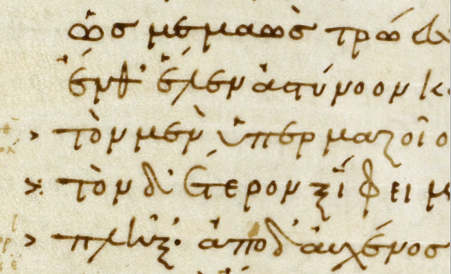
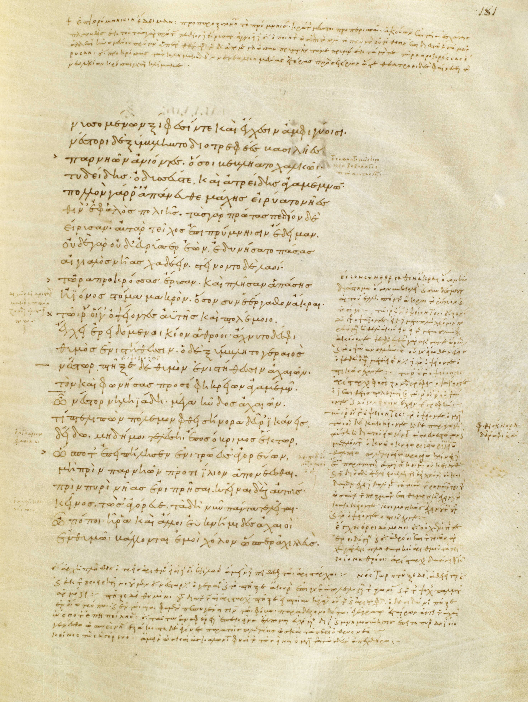

## Introduction and Background

This thesis concerns the tenth-century Venetus A manuscript, the oldest complete manuscript of the *Iliad*. This manuscript is significant both because of its age, as well as because it contains a wealth of scholarly commentary, or scholia, which accompany the text of the poem. These scholia surround the Iliadic text and provide notes on subjects such as grammar and mythology. The question which this thesis will address is the source material which was used for the scholia of the Venetus A. 

The content of the scholia appear to draw from a variety of sources. The manuscript itself, however, provides very little information about the sources that were used for the scholia. At the end of several books of the *Iliad* in the Venetus A, there is a subscription which reads "Alongside the text lie the Signs of Aristonicus, and Didymus’ work On the Edition of Aristarchus, as well as some things from the Prosody of Herodian and Nicanor’s On Punctuation." (translation from Due 7)

Thus, as Casey Due explains in *Recapturing a Homeric Legacy*, "many of the scholia are derived from the work of these four Homeric scholars from antiquity" (Due 7). However, these sources do not account for all of the content in the scholia. These explicitly named sources are all from the first and second centuries C.E. However, throughout the scholia, there are also references to scholars who lived and worked after this time. Thus the manuscript gives us an incomplete view of its source material. Myriam Hecquet, in her chapter on the codicology and palaeography of the manuscript in *Recapturing a Homeric Legacy*, poses several questions concerning the material the scribe was using, such as "Where did he find his exemplars?" and "Were these commentaries already arranged together, or did the scribe excerpt and arrange them together himself for this manuscript?" (74). In response to these questions, Hecquet asserts that "scholars are reduced to hypotheses, to conjectures based on observations of the copy" (74). With this thesis, it is my intention to attempt to move beyond hypotheses in order to obtain a more definite idea of for which scholia we can accurately name the sources.

The question of source material is not unique to this manuscript. The prevalence of references to no longer extant works is a common problem in scholarship on ancient works in general. In the current era, if someone does not cite a quote or idea, it is relatively easy to track down the source using simple internet search methods. However, sometimes even when an ancient author attributes a quote to another work, it is not guaranteed that the text still exists at all. For example, although Plutarch names Cratinus’ play *The Chirons* when providing a quote about Pericles’ bizarrely-shaped head, this play is now lost to us (Plutarch’s Life of Pericles, 3.3). Thus we have no way of reading the context of the quote and learning more about the source. This can be incredibly frustrating at times, as we are unable to gain a fuller understanding of what exact texts authors and editors consulted. Friedrich Wolf, as he discusses the lost sources for the scholia in his 1795 *Prolegomena to Homer*, complains that "the readings and emendations of [the Alexandrian editors] and others were excerpted with varying intentions by many hands and scattered through dictionaries, commentaries, and scholia" (172). It is with these difficulties in mind which we turn to the question of the source material for different content within the scholia of the Venetus A.

Even with the subscriptions provided in the manuscript, there is still no key which explains to the reader which scholia derive from which source. Moreover, the actual content of these sources is unknown. In order to gain an understanding of what these sources said, we must work backwards from the scholia. Thus this thesis aims to be able to identify and recover some of the content from which the scholia draw. This question about the historical transmission of source material is one which scholars have attempted to answer for centuries. However, I will be using digital technology to approach and hopefully get closer to answering this question. I will do this by identifying different features in the scholia which indicate from where a comment derives. Through an analysis of these features of the scholia, specific clusterings of features may become apparent which can be linked to separate sources. However, before going further into the analysis method of the different features of the scholia, I must provide more background on the Venetus A and Homeric epics.

First, we must understand the origin and transmission of the poem which this manuscript features. The origins of the Homeric epics, the *Iliad* and the *Odyssey*, have long been a subject of debate among scholars. Some, such as Martin West, maintain that these poems were written by one single poet. As Gregory Nagy explains in *Homeric Questions,* many scholars who subscribe to this theory believe that “the artistry, cohesiveness, and sheer monumentality of the *Iliad* and the *Odyssey*...prove that such marvels of artistic achievement must have required the technology of writing” (Nagy 30).

However, other scholars believe that the Homeric epics were originally orally composed rather than written. This is a theory which has existed for centuries and which has continued to gather evidence to support it. In his *Prolegomena*, Friedrich Wolf proposes (Although he is by no means the first to suggest this) the possibility that the *Iliad* “and other poems of those times were not consigned to writings, but were first made by poets in their memories and made public in song, then made more widely available by the singing of the rhapsodes” (Wolf 69). Wolf uses this theory to explain the “many differences” among the written forms of the Homeric epics. The 1930s fieldwork of Milman Parry and Albert Lord provide more information on the logistics of oral composition. In *The Singer of Tales*, Lord explains how by observing bards in Yugoslavia, he and Parry were able to witness the process of oral composition in performance. As Lord describes it, “All singers use traditional material in a traditional way, but no two singers use exactly the same material in exactly the same way” (Lord 63). In this way, bards in Yugoslavia and bards in ancient Greece worked from traditional frameworks, but each gave their own unique telling.

In *Homeric Questions*, Nagy continues with this theory. He argues that it is misleading to use the phrase “Homer wrote” when discussing these epics because of both their oral nature and their lack of a single author (Nagy 27). He also proposes a timeline of the composition and transmission of the epics, with the poems being a product of pure oral tradition beginning in the second millennium B.C. and extending to the middle of the first millennium. It was at this point which point they began to interact with writing, eventually transitioning to a completely written format (Nagy 42). Such is the format we have now today.

In this introduction, I have given significantly more attention to this oral theory of the origin of the Homeric epics, as the evidence for it far outweighs the arguments against it. Regardless of one’s opinion on the original composition of the *Iliad*, it is clear that it was eventually written down. Nagy records that the written versions of the *Iliad* most likely began in the middle of the sixth century B.C (Nagy 42). Just as the *Iliad* and the *Odyssey* are now considered foundational works of western literature, so too were they revered in the classical and Hellenistic periods. The *Iliad* received an extraordinary amount of study, with scholars creating their own commentaries and editions. Three specific editors, Zenodotus, Aristophanes, and Aristarchus, who were at different times the heads of the library of Alexandria in the 3rd and 2nd centuries B.C.E., are frequently referenced in the scholia of the Venetus A. These editors are often referred to as the "Alexandrian editors." 

The editions of these Alexandrian editors are unfortunately not extant, and have not been for quite some time. As Wolf notes, at the time the scholiast of the Venetus A was working, "the recensions and interpretations of the leading critics...no longer circulated among the learned in complete form" (Wolf 172). Thus even references to these editors in the scholia are likely taken from other scholars' works on the Alexandrian editors' editions. Wolf laments that "there is not enough left even of those major critics from whose authority our text was first derived to permit us to understand their abilities or their methods of emendation" (172).

As stated previously, the Venetus A contains both the text of the *Iliad* and commentary in the form of scholia. In order to determine what line or phrase a scholion is discussing, the system of lemmata is used throughout this manuscript. In this system, many scholia begin with a lemma, a few words which refer to the line on which the scholion focuses. "This lemma," Mary Ebbott explains, "is often the very word or words being explained or commented on in the [commentary], though it does not always correspond exactly—the lemma at its most basic level indicates the line (there were no line numbers to use) and is an aid for the reader" (Due 43). Thus this system allows the reader to more easily find the word or phrase which is being discussed in the comment. However, this is not the only way in which the comments are anchored to the text of the *Iliad*.

Throughout the manuscript, there are often symbols written to the left of certain lines of the *Iliad* (see Figure 1). These are referred to as “critical signs.” As Graeme Bird explains in his section on critical signs in *Recapturing a Homeric Legacy*, “critical signs are not unique to Venetus A, although they are more fully used in it than in any other surviving Greek manuscript” (Due 95). Often, a sign will appear next to a line, and the corresponding scholion will explain why the sign was placed there. That is, these signs indicate that there is a comment in the margin about something related to the marked line. There are also different possible types of signs, with each type giving a general indication of the category of the comment. Further, it should be understood that critical signs are by no means present for every line on which there is a scholion. That is, there are many lines which have scholia commenting on them but do not have a critical sign. Moreover, there are even some lines which have critical signs but no corresponding comment. 

In the preface to his edition of Homeric scholia, Karl Wilhelm Dindorf explains that these critical signs found in the manuscript are unique to Aristarchus (Nam Aristarchus his solum signis usus erat, Dindorf XIX). That is, Aristarchus himself used these signs in his editions and commentaries (Due 90). As I mentioned above, there are several different types of signs, each with their own meaning: the diple indicates that there is some interesting use of language in the line; the obelos indicates that Aristarchus athetized the line as "unworthy of the poet's splendor" (Wolf 202); the dotted diple indicates that Zenodotus' reading was different from Aristarchus'; the asterisk indicates that the line appears somewhere else as well (Due 92-3). Wolf's explanation of Aristarchus' many atheteses and editorial choices was that his task was not "emending the text to consider what Homer sang, but what he ought to have sung" (Wolf 204). Thus the Venetus A manuscript is so valuable not only because it contains so much scholia, but also because it uniquely contains these critical signs which Aristarchus used when writing his editions. This unique preservation of critical signs will prove to be extremely crucial in the analysis chapters of this thesis, as it provides important information about Aristarchus' work.

## The Question

With this background of the Homeric tradition and the Venetus A manuscript completed, we can now return to the larger questions which this thesis will address: the source material for the scholia. The Alexandrian editors’ editions of the *Iliad* are referenced constantly throughout the scholia in the Venetus A. Aristarchus’ name appears especially frequently in the scholia. His presence in the scholia of this tenth-century manuscript reflects over 1000 years of transmission of his work on Homer. This question, then, intends to trace back over 2000 years in order to reconstruct possibly pure Aristarchan material from the scholia. To be able to label something as Aristarchan, I will examine specific words and patterns of language in the scholia, as well as occurrences of critical signs. My goal in this thesis is not to claim that I have found a magical indicator of what comments come from what editor. However, I intend to identify significant clusterings of features that, when occurring together, suggest from what source a scholion does or does not derive. 

In order to explain how this work is done, I must first explain in more detail both the layout of the manuscript itself and the nature of  the digital editions from which I am working. As I mentioned previously, the Venetus A manuscript contains both the text of the *Iliad*, as well as scholia. However, it is necessary for anyone reading this work to be able to envision how the manuscript actually looks. A typical page, or folio, of the manuscript will contain 25 lines of Iliadic text. To view an example of a standard page in the manuscript, examine Figure 2. This main text is in the very middle of the folio. The rest of the space on the folio is reserved for the scholia. Some pages have little to no blank space because of the high volume of scholia on them. Other pages, however, have only a few scholia on them. There are also 19 replacement folios which contain no scholia or critical signs. That is, they have only the text. 

The scholia in the Venetus A fall into five different categories. Main scholia, which occur most frequently and which have the longest comments, occupy the main, large margin which wraps around the main text. The intermarginal scholia fall in between the main text and the main scholia. The interior scholia fall between the main text and the binding. The interlinear scholia fall in between the lines of the main text and usually comment on specific words. Finally, the exterior scholia fall in the outermost edge of the folio. The reasoning for there being different zones for the scholia has never been definitively explained. However, there do appear to be definite differences in the content among the different scholia zones. That is, an interlinear scholion seems to serve a distinctly different purpose than a main scholion. The former type are often only a word long and provide glosses on specific words, while the latter can be well over one hundred words and address much more complex points. Thus these zones are content specific. Further, these differences go beyond simply the length of the comments. Throughout the manuscript, there are certain patterns of words and phrases which appear more frequently in certain types of scholia than in others. In addition, these patterns can be associated with specific names as well. Thus a difference in content potentially points toward a difference in source material. Therefore these zones are an important feature which cannot be ignored in this analysis. Charlie Schufreider, with whom I collaborated closely during this project, has a thesis which focuses more specifically on the layout of this manuscript and the differences between the zones. For my purposes, however, it is only necessary that I provide an overview of its composition.

The reason I have taken the time to describe the particular layout of this manuscript is because its format is crucial for understanding how the digital editions are arranged. This thesis relies on the digital editions of the Venetus A manuscript created by members of the Homer Multitext project. The goal of the Homer Multitext project (HMT) is “to present the Homeric *Iliad* and *Odyssey* in a critical framework that accounts for the fact that these poems were composed orally over the course of hundreds, if not thousands of years by countless singers who composed in performance” (HMT website). Because of this philosophy and the complexity of the manuscripts from which the HMT work, they must use digital technologies in order to create their editions.

Moreover it is precisely the digital format of these editions which is most crucial to this thesis, as it is what makes any sort of large-scale analysis on the scholia possible. There are around 10,000 scholia in the Venetus A altogether. This thesis is working from the 18 books of the Venetus A which the HMT has released. These books contain roughly 8,000 scholia, a sufficient sample size for analysis. Previous scholars of the manuscript simply did not have the proper tools to make definitive claims on certain aspects of the manuscript due to the density of information it contains. Thus, even if a scholar were to notice a pattern which appeared in ten different places, they still would not easily be able to know how that pattern was distributed across the manuscript as a whole. That is, previous work was, by necessity, largely anecdotal.

A more thorough background on the HMT editions of the Venetus A is also necessary for understanding the analytical process. One important feature of the HMT is the level of division within the editions. Not only are there separate XML documents for each book of the Venetus A, but the Iliadic text and the scholia are also separated. Going another step further, there are separate documents for each scholia type. This is significant because, as I explained earlier, there is a difference in content between the scholia types. Thus each text-group is self contained and can be analyzed separately.

The HMT creates diplomatic digital editions which attempt to faithfully represent exactly what appears on each page of the manuscript. This is in contrast to conventional critical editions, which often “correct” what is in the manuscript so that the text adheres to the contemporary standards for the language. This is not to say that the HMT makes no judgment at all when creating their editions. However, it is not their goal to fix what the scribe wrote or create some idealized, perfect text. Thus, if the scribe did not include an accent or breathing mark on a word, the edition does not contain it either. The HMT's editions are linked to pictures of the manuscript so that anyone who looks at the editions can check the manuscript to see the text for themselves.

Beyond this, the HMT uses a limited set of TEI markup when editing the XML text of the *Iliad* and the scholia. These features which are tagged in TEI markup provide more information about the text as it appears in the manuscript. One such feature which can be recorded through this markup is alternate readings within the text. Alternate readings can take a variety of forms, including abbreviations and corrections. When there is an abbreviation in the manuscript, the edition records the exact letters which are written. In addition, the edition also provides the likely expansion of the word. These two words are recorded next to each other, with the former wrapped in an &lt;abbr> tag, and the latter in an &lt;expan> tag. Both of these words are then wrapped in a single &lt;choice> tag, which indicates that they represent different encodings for the same word. Similarly, when the scribe corrects himself in the manuscript by crossing out an accent mark or noticeably changing a letter, the &lt;sic>/&lt;corr> pairing is used. What appears to be the first recording of the word is the "sic," while the corrected version of the word is the "corr." Once again, both of these words are grouped together by the element "choice." The existence of these alternate readings in the editions means that when conducting an analysis, one must choose which reading to include. The difficulties which this presents will receive more attention in the methodology chapter. 

Another feature of the text which is pertinent to this thesis is the appearance of personal names. Each time any person is referenced in the Iliadic text or the scholia, they are tagged with a unique identifier. The HMT maintains a list of every person and place mentioned in the text along with their corresponding unique numerical identifier. Thus if one wanted to find every instance of Achilles, it would be as simple as searching for every instance of his identifier. This removes the difficulty posed by the various forms that nouns have in Ancient Greek, as well as the use of patronymics. This is also helpful in the case of very common names, such as Ptolemy. If I wanted to find all of the instances of a specific Ptolemy, the unique identifiers make it much easier for me to find the correct one, rather than have to wade through the references to all of the Ptolemies. It is this method of tagging personal names which allows me to systematically extract all the references to the Alexandrian editors throughout the scholia.

It is also important to note that the HMT has a separate document for recording critical signs. Because these are not part of the text, they are not included in the editions of the main text or scholia. Instead, occurrences of critical signs are recorded in a separate index which can also be used for analysis. The index of critical signs includes the specific type of critical sign as well as the *Iliad* line number it appears next to in the manuscript.

Using these digital editions of the scholia from the HMT archives, it was possible to create a model which identifies every semantically significant token and identifies several categories of information about each token. From this, I was then able to analyze the XML in terms of this model and thus have a workable data set from which I could extract the scholia which have features interesting to me. A more in depth discussion of how I obtained workable date from these XML editions, as well as the many challenges that accompany this work, is discussed in the following chapter on methodology. 
